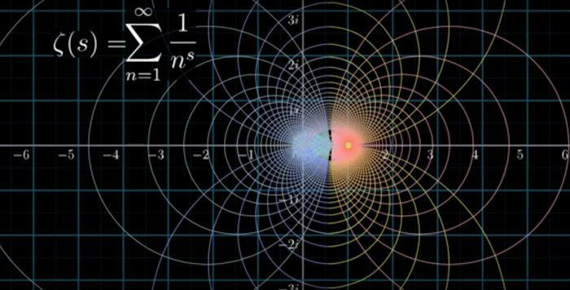

# 🙊 Perfecting Language

*Nor grieve, dear heart,*  
*nor fear the seeming.*  
*Here is waking in the dreaming.*  

Is it possible to guard totally against the inertia of language? Clearly, we cannot achieve this in natural language, but might we be able to develop a "perfect language" in which I can say exactly what I mean, you can understand exactly what I meant, and I can be sure you have understood it exactly? Many people have tried to answer this, so let's go on a mathematical tour through universal languages and the incomplete search for linguistic perfection. 

> The crucial point is that knowing this language would be like having a key to universal knowledge. If you’re a theologian, it would bring you closer, very close, to God’s thoughts, which is dangerous. If you’re a magician, it would give you magical powers. If you’re a linguist, it would tell you the original, pure, uncorrupted language from which all languages descend.

**The Search**

[Read it](https://inference-review.com/article/the-perfect-language)

### How does this fit into KERNEL?

The sacred is not perfect. The *source* of what we call "sacred" is beyond any label, including "perfect". When we conflate the two, we propagate violent and oppressive ideologies which are convinced of their own correctness or truth. The sacred as we experience it in every day life is undecidable, irreducible, paradoxical.

When we accept this fact, as this article will show you, it reveals some really interesting and practical contexts in which we can more closely approach a perfection we know to be inherently irreducible. This is a truly beautiful thing to do. It is the best way to close this open-ended course. Thank you all, and we wish you a peace past any understanding.

## Brief

Gregory Chaitin discusses Umberto Eco's book *[The Search for the Perfect Language](https://www.goodreads.com/book/show/10513.The_Search_for_the_Perfect_Language)*, and how it relates to some deep concepts in mathematics, coupled with a non-standard view on intellectual history. He begins by asking,

> What is the perfect language? [... It is] the language whose structure directly expresses the structure of the world, in which concepts are expressed in their direct, original format.

He discusses some of the early figures of this search, including Raymond Lull and Gottfried Leibniz. Though both grounded in magical and theological thinking - as well as alchemy and hermeticism - it was Leibniz who first formulated the search in a modern way, calling this language the *characteristica universalis. A* crucial part of this language was something he called the *calculus* *ratiocinator*, by which we can reduce reasoning to calculation and thereby elide the need for opinonated arguments in favour of pure computation.

It was this notion which led him to develop calculus. Leibniz's version was slightly different from Newton's, in that his focus was specifically on the notation and formalism: i.e. how can we generate the most expressive power from the smallest set of meaningful symbols? His calculus presents a fundamentally mechanistic approch to proof, as Leibniz saw clearly the importance of having a formalism that led you automatically to the answer.

### Set and Setting

Chaitin then describes the theory of infinite sets as *mathematical theology*:

> Cantor’s goal was to understand God. God is transcendent. The theory of infinite sets has a hierarchy of bigger and bigger infinities, the alephs, the ℵ’s.

These sets go on forever, as you can always make a new set out of the set of all previous sets, or by taking a union of all the members of an infinite sequence to get ever greater infinities. However, this leads to a contradiction, discovered by Bertrand Russell and now called the Russell paradox: if we take the universal set - the set of everything - and then consider the set of all subsets in it, then this set of all subsets must necessarily be bigger than the universal set. But how can this be? The set of all subsets of the universal set can neither be in itself nor not be in itself - which poses a problem for mathematicians who are not theologically inclined.

While this contradiction never bothered Cantor - who took the view that it’s paradoxical for a finite being to try to comprehend a transcendent, infinite being, so paradoxes are fine - it led Russell to expose numerous contradictions in mathematical reasoning. As a response to this, another mathematician called Davild Hilbert developed a completely formal axiomatic theory, which is a modern version of Leibniz’s *characteristica universalis* and *calculus ratiocinator*.

Axiomatic theories are written not in natural language with its ambiguity and informal reasoning, but in precise, artificial languages based on mathematical logic which specifies the rules of the game precisely.

### Empty and Incomplete

The dream that there is a finite set of axioms which allowed us, in principle, to deduce all mathematical truth led to some truly beautiful work, in particular Zermelo–Fraenkel set theory and von Neumann integers.

> Baruch Spinoza had a philosophical system in which the world is built out of only one substance, and that substance is God, that’s all there is. Zermelo–Fraenkel set theory is similar. Everything is sets, and every set is built out of the empty set. That’s all there is: the empty set, and sets built starting with the empty set.

However, Gödel and Turing showed in the 1930's that you can’t have a perfect language or a formal axiomatic theory for all of mathematics because of incompleteness. Gödel began with the statement "This statement is unprovable" and proceeded to show how the paradox at the heart of this (using [Gödel numbering](https://en.wikipedia.org/wiki/G%C3%B6del_numbering)) reveals that we cannot capture all mathematical truth in any theory.

Turing derived incompleteness from a more fundamental phenomenon:

> Turing’s insight in 1936 was that incompleteness, that Gödel found in 1931, for any formal axiomatic theory, comes from a deeper phenomenon, which is uncomputability. Incompleteness is an immediate corollary of uncomputability, a concept which does not appear in Gödel’s 1931 paper.

The fact that Gödel's incompleteness is a result of uncomputability suggests that, while there is no perfect mathematical language, **there are perfect languages for certain computations**.

> What Turing discovered in 1936 is that there’s a kind of completeness called universality and that there are universal Turing machines and universal programming languages [... that is,] a language in which every possible algorithm can be written.

### Algorithms and Information

Chaitin goes on the describe his own work in Algorithmic Information Theory, which derives incompleteness from an extreme form of uncomputability, called algorithmic irreducibility. A deeper understanding of the mathematically irreducible information contained in the Halting Problem allows us to

> pick out, from Turing’s universal languages, maximally expressive programming languages, which are maximally compact.

AIT is really about deducing the size of the smallest program required to calculate something, which allows us to create "better" notions of perfection, defined in terms of conciseness. 

> The most expressive languages are the ones with the smallest programs. This definition of complexity is dry and technical. But let me put this into medieval terminology, which is much more colorful. What we’re asking is, how many yes/no decisions did God have to make to create something?—which is obviously a rather basic question to ask, if you consider that God is calculating the universe [...] God will naturally use the most perfect, most powerful programming languages, when he creates the world, to build everything.

These most powerful programming languages can be expressed succinctly in AIT by considering a paritcular class of universal Turing machines **_U_**, and the most efficient ways for these machines to be universal. Chaitin describes some of the ways we have of calculating this, which extend more deeply in the details of AIT than this brief will go. 

What's most relevant is how we can get define programs in **self-delimiting ways**. That is, how can we get our universal Turing machine **_U_** to know when a program has ended without adding an extra symbol (i.e. just using 0 and 1, no blanks); or extra information about the size of the program to the program itself, thereby making any computation less concise than the ideal.

### Just Write

> These self-delimiting binary languages are the ones that the study of program-size complexity has led us to discriminate as the ideal languages, the most perfect languages. We got to them in two stages, 1960s AIT and 1970s AIT. These are languages for computation, for expressing algorithms, not for mathematical reasoning. They are universal programming languages that are maximally expressive, maximally concise.

What does this mean for the search for a perfect language? Well, it's a bit of a mixed bag. Hilbert's formal axiomatic theory meant to establish all mathematical truth is necessarily incomplete, and all formal reasoning has been proven to have a limit. However, 

> There are **perfect languages for computing**. We have universal Turing machines and universal programming languages, and although languages for reasoning cannot be complete, these universal programming languages are complete. Furthermore, AIT has picked out the most expressive programming languages, the ones that are particularly good to use for a theory of program-size complexity.

Practically speaking, the search for the perfect language has yielded some truly fascinating results. Theoretically, it has shown that mathematics contains infinite irreducible complexity and so there is no hope of finding a simple and elegant Theory of Everything like Hilbert imagined. That dream turned out to be a golem, but

> from the perspective of the Middle Ages, I would say that the perfect languages that we’ve found have given us some magical, God-like power, which is that we can breathe life into some inanimate matter. Observe that hardware is analogous to the body, and software is analogous to the soul, and when you put software into a computer, this inanimate object comes to life and creates virtual worlds.

### Many Worlds

**Pay Attention**

[Pray](http://www.phys.unm.edu/~tw/fas/yits/archive/oliver_thesummerday.html)

