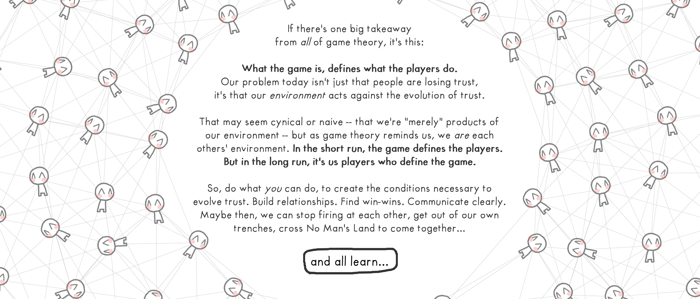

# ☯ Patterns

## Identify Patterns

> KERNEL Fellows will separate themselves by their ability to **identify patterns**.

> Pattern recognition is at the core of cognition. Becoming more conscious of patterns which already exist, as well as how you choose to interact with those in your local environment, is the single best thing you can do to improve your critical thinking skills.

Pattern recognition is not just the core of cognition, it's also one of the main drivers of play. As humans, we like finding and creating patterns. Our brains are hardwired to do this-- so much so that some of the most popular games we play are built around pattern recognition mechanics.

[The connection between psychology and games are well-understood today](./crafted.md#engines-of-play). However, a decade or so ago, games were designed more as a craft than as a science.

Daniel Cook is one of the earliest and most insightful explorers of this space. His [Chemistry of Game Design](./crafted.md#chemistry-of-game-design) was one of the earlier game design essays that recognized the biological impulses that lead us to play. He writes:

> Play is instinctual. In low stimulation environments where we are not actively pursuing activities related to food and shelter, people will begin playing by default. Strong feedback mechanisms in the form of boredom or frustration prod us into action. Given a spare moment, we throw ourselves into playing with blocks or dolls as children and more intricate hobbies as adults.

Now, moving into the attention economy age, game designers know more than ever about various innate human drives. After years of harvesting analytics, they have a great deal of training data on player behavior, [and are able to reliably make players take an incentivized action](./curated.md#deconstructor-of-fun), like watching an ad.

[We now have god-like technology to control the paleolithic brains of our users](./curated.md#two-millon-years-in-two-hours-a-conversation-with-yuval-noah-harari).

## Humility

This has always been a pattern of technology: the startups working on seemingly esoteric technologies will be the ones who define the thought patterns of future generations.

Similar to how Web 2 merged games and psychology, Web 3 will bring about deeper integration of finance, economics, and games. 

What will be the implications of this? And, as KERNEL fellows, how should we be building these potentially god-like technologies?

> KERNEL Fellows should have humility. We cannot be sure what the effect of our actions will be, we can only cultivate an acute observational awareness which will guide us toward making the right trade-offs.

> If you want to change the world, the world will inevitably act back and change you. The results of Web 2 applications have made this clear. The greater our collective humility, the more gentle this exchange will be as Web 3 comes to life.

If the world acts back and changes us, [what happens if the games we make and play act back on us, and play us instead?](./curated.md#a-game-designers-analysis-of-qanon)

## Complementary Opposites

> In particular, we hope KERNEL Fellows begin thinking in terms of **complementary opposites**.

> Rather than using dualities like 'decentralization good, centralization bad'; or 'DeFi is innovative, fiat is boring', this style of thinking recognizes that there is no good without evil; no attraction without repulsion, no North with South, no up without down.

As creators who realize the power of patterns and are humbled by it, we also have to look inward and see what patterns and loops we ourselves are running. 

Web 3 is a powerful movement, and it's easy to fall into the common pattern of tribal thinking. [We need to hold our ideas lightly](./curated.md#a-theory-of-everything), turn our ideas upside down, and see if there is more we can learn by looking at them from a different perspective.

[Some interesting questions to ask are](./crafted.md#stuffed-blocks): Are NFTs really the future of virtual items? Do they make our games more fun to play? Do we really want our games to have open in-game economies? 

Another exercise we can do is to immerse ourselves in the centralized game or platform we're trying to disrupt. If we want to be able to build a game that can compete with what gamers are playing right now, [we have to look at these games objectively, as a player, and recognize what makes them compelling.](./crafted.md#web3-game-counterparts)

# 🤺 Trust

> If there's one big takeaway from *all* of game theory, it's this:

> **What the game is, defines what the players do.**

As observed in [virtual economies of sufficient size](./curated.md#virtual-economies-design-and-analysis), agents will always take the rational choice. Players will behave predictably in a competitive market and, with enough knowledge, we can design for stability. By understanding virtual economies, we can better understand how to design ecosystems for greater trust.

Trust is important between players, but as our game designs become more democratic, we need to start considering trust in other relationships as well, such as between players and developers.

How can we create an environment of greater trust between game developers and players? Do we want them to be able to govern and influence game design, or are [the incentives between developers and players](./crafted.md#ttvdrandoks-review-of-eve-online) just too different?

# 🎮 A Game Each Week

<a target="_blank" rel="noopener noreferrer" href="https://play.google.com/store/apps/details?id=com.pinkpointer.kakuro">Kakuro</a> - or Cross Sums, is a variant of Sudoku. A great game for more pattern recognition fun.

<a target="_blank" rel="noopener noreferrer" href="https://play.google.com/store/apps/details?id=com.innersloth.spacemafia&hl=en&gl=US">Among Us</a> - a fun exploration of trust among players, and one of the most successful games of 2020. Which one is the impostor?!