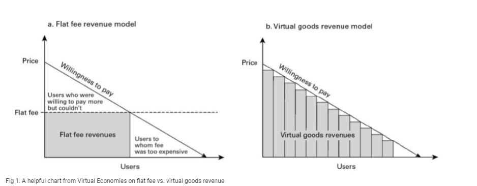
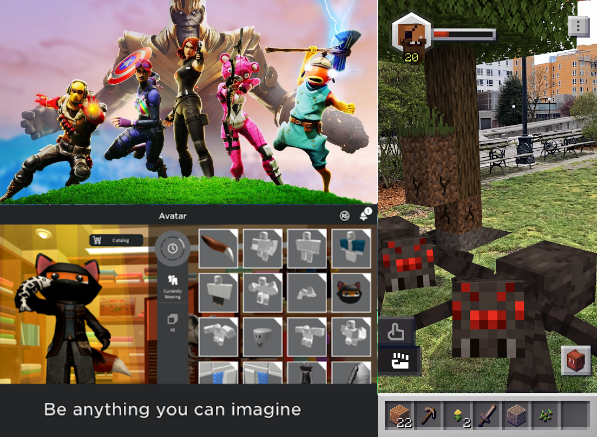

# ⚖ Jamming On Value

## What is Value
> This is, in a sense, the ultimate question. So, how can we use our new thinking skills based on complementary opposites to break it down and come to some useful insights?

> Without tracing the whole history, one can see **how our ability to create value has always been tied to the ways in which we tell stories about, and with, our shared records**. 

As we play around with the concept of value, thinking in **complementary opposites** makes our understanding more complete. 

We've previously defined *value* in the context of [**consensus**](../../../module-1/value/#consensus) and [**narrative**](../../../module-1/value/#narrative). Alternatively, we can also view *value* from an economist's lens, leading us to other terms such as **goods** and **scarcity**.

## In a Virtual World

**Scarcity** of **goods** is a central concept of economics. It drives economic processes such as trade, production, and consumption. These processes in turn affect social behavior, determining how trust is built in our communities. However,

🌍 In a virtual world, the cost of production of a virtual good is effectively ZERO.

Before computer games introduced the concept of virtual goods, this was unheard of. Physical goods ALWAYS had a production cost. With virtual goods, all it takes is a few processing cycles in a computer to create an item.

If there's no cost to produce a good, then *how can it be scarce*?

💡 The scarcity of virtual goods is merely shared fiction.

This foundational change necessitates rethinking our economics. What happens to our well-balanced equations when a variable suddenly disappears? How will market forces adapt when supply is infinite?

Fortunately, Lehdonvirta and Castranova dig deep into these concepts in [ Virtual Economies: Design and Analysis](../module-0/curated.md#virtual-economies-design-and-analysis). The whole book is a rich space for understanding value, and should be required reading for any web 3 builder. 

The important points the book mostly circle back to the attention economy:

> Today, at least in the world of online games and digital services, the scarcest resources are no longer food and shelter, but human attention. In the pursuit of this resource, even the economy itself needs to be fashioned into a consumable good.

## Of Metaverses

The quote ends with a salient point: with human attention being so finite, any participation in virtual economies has to be compelling.

The most successful game developers recognize this. They are the ones leading the race to realize the [Metaverse / Mirrorworld](./crafted.md#of-mirrorworlds-and-metaverses) vision -- one platform that will capture the most value. 

Each developer has their own strategy: Fortnite does massive cross-overs with music and film; Roblox banks on user-generated content; and Minecraft relies on AR and cross-licensing to other games. Their attempts have been largely successful, generating billions of dollars in revenue and creating a similarly massive economy of their virtual goods.

👀 More importantly, these games have become part of popular culture, commanding the attention of hundreds of millions of players.

As Web 3 game developers, we need to realize that [these are just some of the forces](./crafted.md#industry-references) shaping the Metaverse right now. If human attention is the most valuable resource, how will we fare against these meticulously designed games? If the only use-case for an NFT is for speculation, and we're competing against virtual goods with established utility and network effects, how relevant will our NFTs be in future iterations of the Metaverse?

## And NFTs

We have at least planted the seeds of innovation. From Virtual Economies:

> Economic processes such as production, logistics, and trade are not simply means towards ends but can also be fun in themselves.

> Game content does not always have to be inspired by adventure and combat. It can also be about trade and industry.

The NFT standard allowed Web 3 games to create exactly this kind of content. Through it we've discovered new gameplay primitives centered around trade: breeding NFTs, collecting crypto art, turning a profit from staking. 

Moving forward we need to look beyond trade, into other areas where Web 3 can provide value. For example, there might be nuggets of gameplay we can find from user-driven governance in DAOs.

It's these primitives that will allow Web 3 games to compete asymmetrically against the incumbents. To truly shape the Metaverse, we need to discover a few more. 

## Let's Jam

Web 3 fortunately follows an open-source ethos, and we can refer to [several great game developers](./curated.md#web-3-game-developers-to-follow) in the space from whom we can draw inspiration.

Another way is by bringing people of different backgrounds and skillsets together, via game jams and hackathons. [Cryptokitties](./curated.md#cryptokitties-origin-story) was famously the product of one in ETHWaterloo.

These events are optimized towards finding the beginnings of a great idea. Each one is a focused unit of time, which starts with the promise of a blank slate, but is constrained just enough - by a theme and a deadline - to focus our efforts.

In these environments, where we have to agree on a narrative with a diverse group of people, we are driven to create.

> Separate the processes of creation from improving. You can’t write and edit, or sculpt and polish, or make and analyze at the same time. If you do, the editor stops the creator. While you invent, don’t select. While you sketch, don’t inspect. While you write the first draft, don’t reflect. At the start, the creator mind must be unleashed from judgement. - <a target="_blank" rel="noopener noreferrer" href="https://kk.org/thetechnium/68-bits-of-unsolicited-advice/">Kevin Kelly</a>

# 🎮 A Game Each Week

<a target="_blank" rel="noopener noreferrer" href="https://en.gameslol.net/adventure-capitalist-1086.html">Adventure Capitalist</a> - One of the pioneers of the idle game genre. Perhaps value can just be measured in clicks and 🍋s?